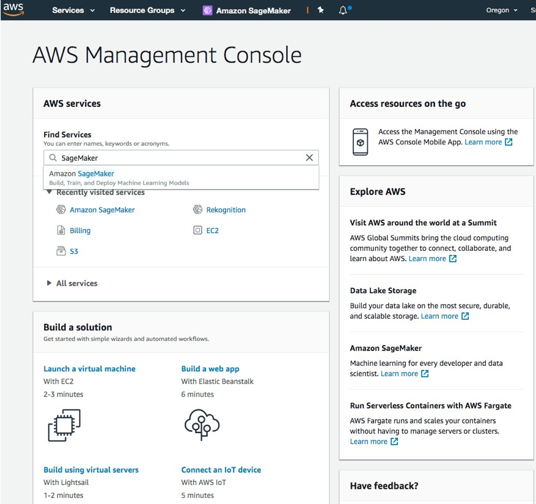
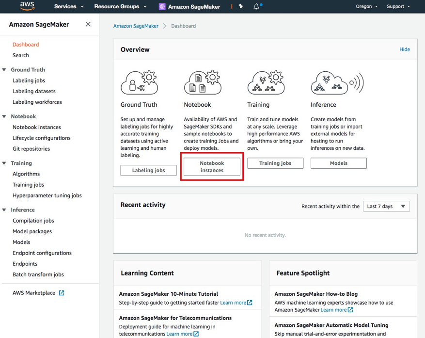
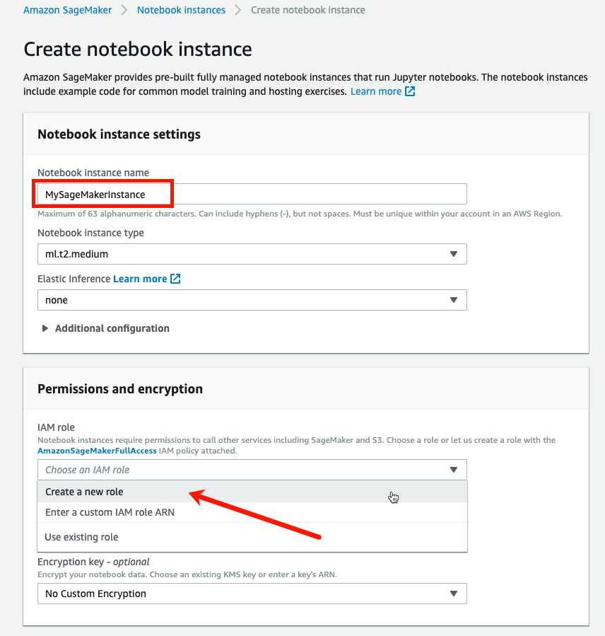
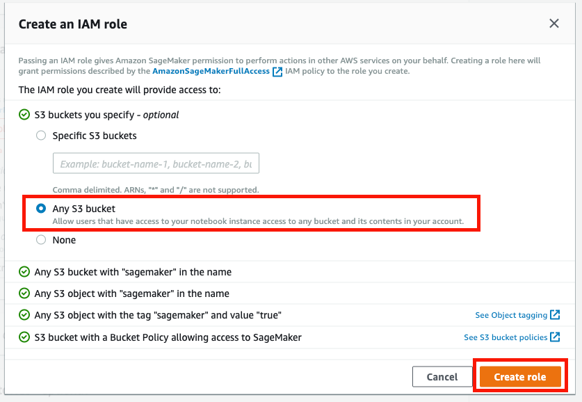
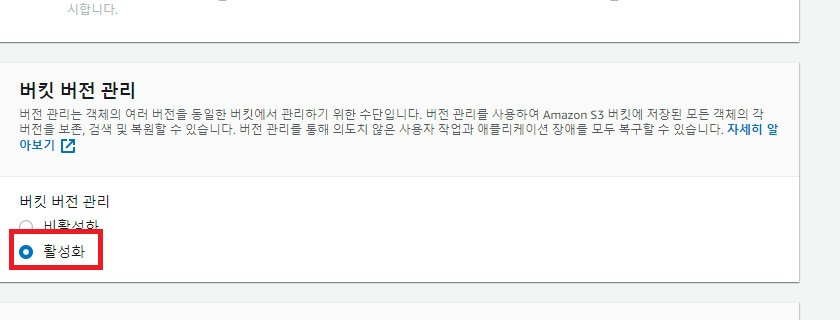
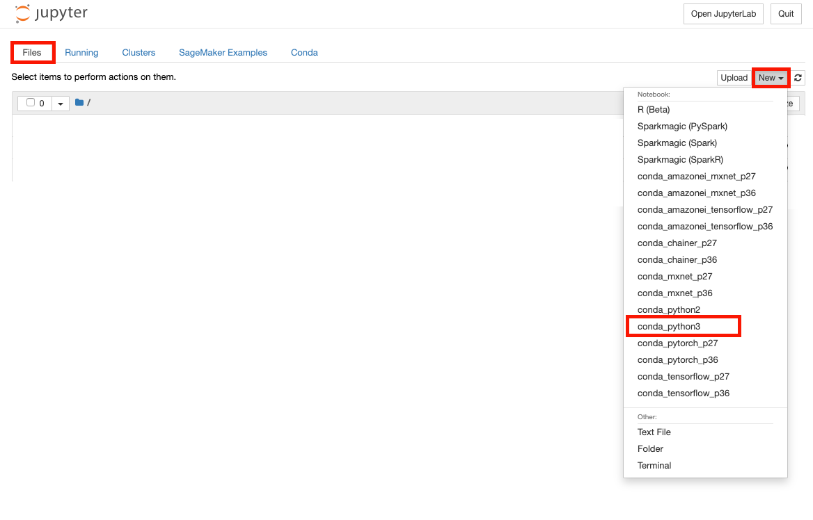

# sagemaker 를 이용한 ML 분석

- sagemaker 설명에 따르면, 프리티어의 경우 무료로 진행할 수 있다고 나와 있으나, 
  자원을 종료하지 않거나, 많은 양의 데이터를 스토리지에 넣을경우 과금이 되므로 주의합니다. 

  아래 sagemaker 설명 참조

  ```
  이 자습서에서 생성되고 사용된 리소스는 AWS 프리 티어에 해당합니다. 7단계를 완료하고 리소스를 종료해야 합니다. 2개월 이상 계정에서 이 리소스가 활성화되어 있으면 계정에 0.50 USD 미만의 비용이 청구됩니다.
  ```
 - 본 실습 예제는 AWS에서 제공하는 자습서를 참조하였습니다.  https://aws.amazon.com/ko/getting-started/hands-on/build-train-deploy-machine-learning-model-sagemaker/

## 은행 마케팅 데이터를 사용하여 은행 예금상품에 가입할지 하지 않을지 예측하기

- `http://archive.ics.uci.edu/ml/datasets/bank+marketing`


## 1단계. Amazon SageMaker 콘솔 열기

- Amazon SageMaker 콘솔로 이동 
- 검색창에 SageMaker를 입력하고 Amazon SageMaker를 선택해서 서비스 콘솔 열기





## 2단계. Amazon SageMaker 노트북 인스턴스 생성

- 2a. Amazon SageMaker 대시보드에서 노트북 인스턴스를 선택 



- 2b. 노트북 인스턴스 생성 페이지에서 [노트북 인스턴스 이름] 필드에 이름을 입력

- [ IAM 역할] 필드에서 [새 역할 생성]을 선택하고 Amazon SageMaker가 필수 권한을 가진 역할을 생성하고 인스턴스에 할당




- 2c. [IAM 역할 생성] 상자에서 아무 S3 버킷을 선택


- 2d. Amazon SageMaker가 AmazonSageMaker-ExecutionRole-***이라는 역할을 생성한 것을 확인


- 노트북 인스턴스는 2분 이내에 Pending에서 InService 상태로 변경


## 3단계. 데이터 준비


- bucket 서비스로 데이터 버저닝이 되는 bucket을 생성





- 노트북 상태가 InService로 전환되면 MySageMakerInstance를 선택하고 [작업] 드롭다운 메뉴를 사용하거나 InService 상태 옆에 있는 [Jupyter 열기]를 선택


- 3b. Jupyter가 열리면 [파일] 탭에서 [새로 만들기]를 선택한 다음, conda_python3를 선택



- 3c. 데이터 준비 (생성한 버켓이름과 sagemaker의 API를 import)

```
bucket = 'sagemaker-cuk'
prefix = 'sagemaker/xgboost_credit_risk'

# Define IAM role
import boto3, re, sys, math, json, os, sagemaker, urllib.request
import re
import pandas as pd
import numpy as np
import matplotlib.pyplot as plt
import os
import sagemaker
from sagemaker import get_execution_role
from sagemaker.inputs import TrainingInput
from sagemaker.predictor import csv_serializer 

role = get_execution_role()


my_region = boto3.session.Session().region_name

print("Success - the MySageMakerInstance is in the " + my_region + " region. You will use the" )

```

- 3d. 은행 마켓팅 데이터 가져오기

```
try:
  urllib.request.urlretrieve ("https://d1.awsstatic.com/tmt/build-train-deploy-machine-learning-model-sagemaker/bank_clean.27f01fbbdf43271788427f3682996ae29ceca05d.csv", "bank_clean.csv")
  print('Success: downloaded bank_clean.csv.')
except Exception as e:
  print('Data load error: ',e)

try:
  model_data = pd.read_csv('./bank_clean.csv',index_col=0)
  print('Success: Data loaded into dataframe.')
except Exception as e:
    print('Data load error: ',e)
```

- 3e. 데이터 셋 살펴보기

```
dataset = pd.read_csv('bank_clean.csv')
pd.set_option('display.max_rows', 8)
pd.set_option('display.max_columns', 15)
dataset
```

- 3f. 학습데이터와 테스트 데이터를 분할하기

```
train_data, test_data = np.split(model_data.sample(frac=1, random_state=1729), [int(0.7 * len(model_data))])
print(train_data.shape, test_data.shape)
train_data
```

- 3g. 학습데이터의 라벨을 컬럼 앞으로 배치하고, 데이터셋의 헤더를 삭제

```
pd.concat([train_data['y_yes'], train_data.drop(['y_no', 'y_yes'], axis=1)], axis=1).to_csv('train.csv', index=False, header=False)
train_dataset = pd.read_csv('train.csv')
train_dataset
```

- 3h. 학습데이터를 s3에 로드 하기

```
boto3.Session().resource('s3').Bucket(bucket).Object(os.path.join(prefix, 'train/train.csv')).upload_file('train.csv')
s3_input_train = TrainingInput(s3_data='s3://{}/{}/train'.format(bucket, prefix), content_type='csv')
```

## 4단계. 모델 학습하기

- 4a. xgboost 모델을 컨테이너 정보 가져오기 (sagemaker는 분석 모델을 컨테이너화 하여 학습시에 컨테이너로 수행)

```
containers = {'us-west-2': '433757028032.dkr.ecr.us-west-2.amazonaws.com/xgboost:latest',
              'us-east-1': '811284229777.dkr.ecr.us-east-1.amazonaws.com/xgboost:latest',
              'us-east-2': '825641698319.dkr.ecr.us-east-2.amazonaws.com/xgboost:latest',
              'eu-west-1': '685385470294.dkr.ecr.eu-west-1.amazonaws.com/xgboost:latest',
              'ap-northeast-2': '306986355934.dkr.ecr.ap-northeast-2.amazonaws.com/xgboost:latest'}
```

- 4b. sagemaker의 세션을 열고, 학습할 리소스의 type과 하이퍼파마미터를 설정


```
sess = sagemaker.Session()
xgb = sagemaker.estimator.Estimator(containers[my_region],role, train_instance_count=1, train_instance_type='ml.m4.xlarge',output_path='s3://{}/{}/output'.format(bucket, prefix),sagemaker_session=sess)
xgb.set_hyperparameters(max_depth=5,eta=0.2,gamma=4,min_child_weight=6,subsample=0.8,silent=0,objective='binary:logistic',num_round=100)
```

- 4c. 학습 수행


```
xgb.fit({'train': s3_input_train})
```


## 5단계 학습 모델 배포

- 5a. 학습 모델을 배포할 instance type을 설정한 후 모델을 배포

```
xgb_predictor = xgb.deploy(initial_instance_count=1,instance_type='ml.t2.medium')
```

## 6단계 학습된 모델 테스트 하기

- 6a. 테스트 데이터셋에 라벨을 제거하고, 테스트 데이터를 어레이 형태로 변환

```
test_data_array = test_data.drop(['y_no', 'y_yes'], axis=1).values #load the data into an array
predictions = xgb_predictor.predict(test_data_array).decode('utf-8') # predict!
predictions_array = np.fromstring(predictions[1:], sep=',') # and turn the prediction into an array
print(predictions_array.shape)
```

- 6b. 모델을 테스트하고 Confusion Matrix로 결과 나타내기

```
cm = pd.crosstab(index=test_data['y_yes'], columns=np.round(predictions_array), rownames=['Observed'], colnames=['Predicted'])
tn = cm.iloc[0,0]; fn = cm.iloc[1,0]; tp = cm.iloc[1,1]; fp = cm.iloc[0,1]; p = (tp+tn)/(tp+tn+fp+fn)*100
print("\n{0:<20}{1:<4.1f}%\n".format("Overall Classification Rate: ", p))
print("{0:<15}{1:<15}{2:>8}".format("Predicted", "No Purchase", "Purchase"))
print("Observed")
print("{0:<15}{1:<2.0f}% ({2:<}){3:>6.0f}% ({4:<})".format("No Purchase", tn/(tn+fn)*100,tn, fp/(tp+fp)*100, fp))
print("{0:<16}{1:<1.0f}% ({2:<}){3:>7.0f}% ({4:<}) \n".format("Purchase", fn/(tn+fn)*100,fn, tp/(tp+fp)*100, tp))
```


## 7단계 모든 리소스 종료!!!!!! (중요)


```
sagemaker.Session().delete_endpoint(xgb_predictor.endpoint)
bucket_to_delete = boto3.resource('s3').Bucket(bucket)
bucket_to_delete.objects.all().delete()

```